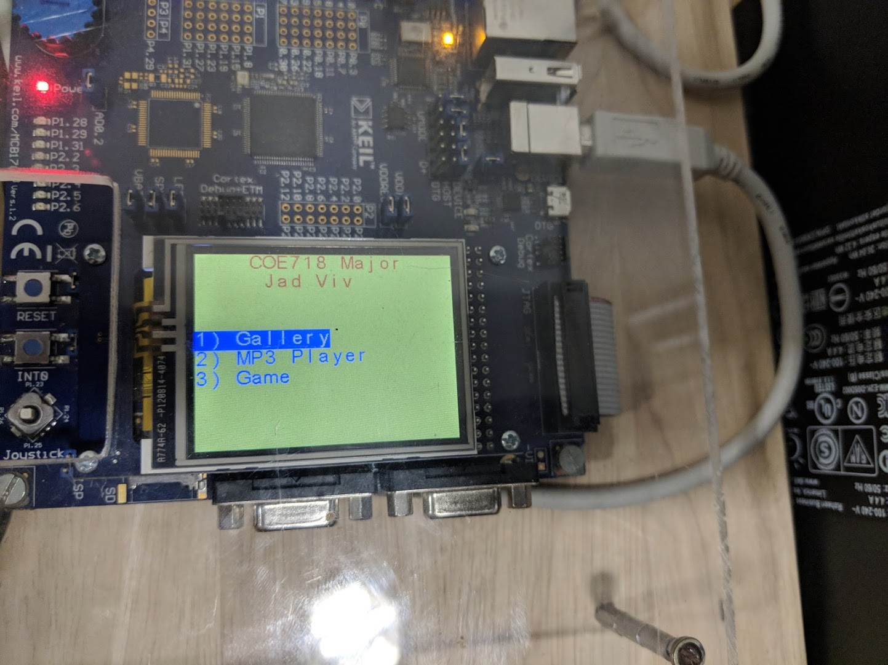
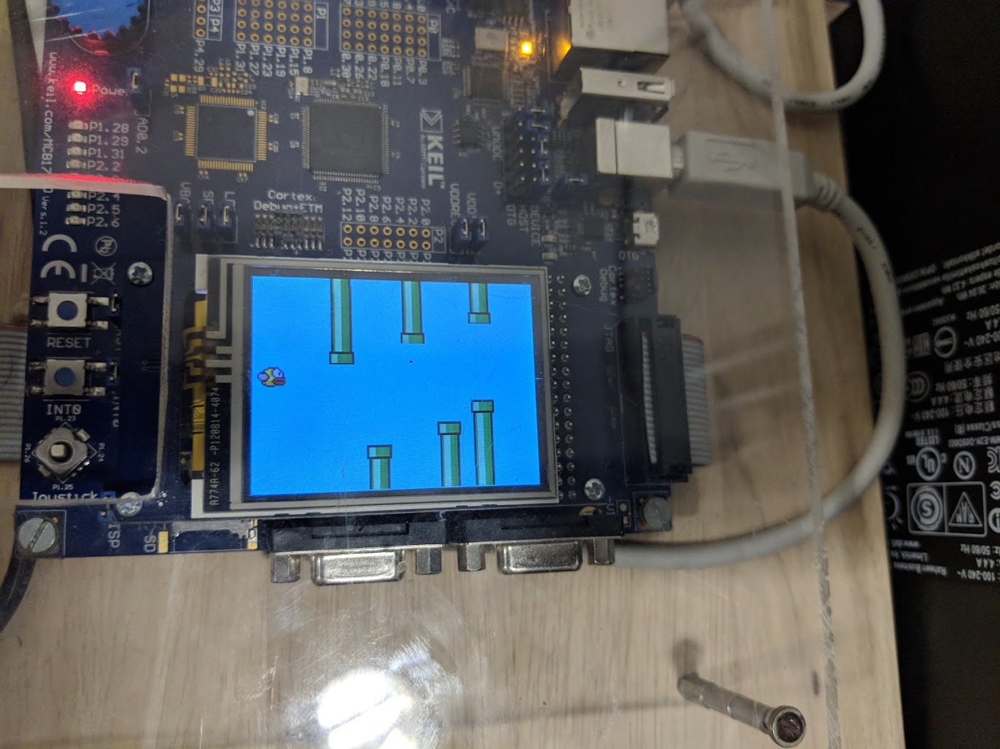
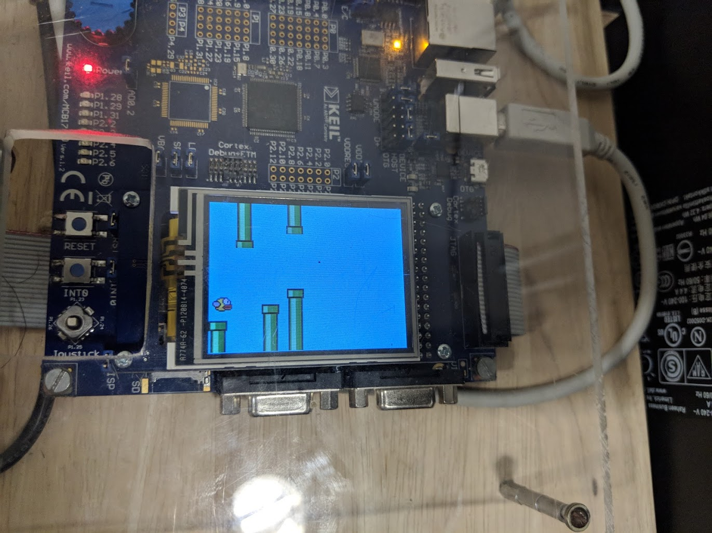

## COE718_mediacenter

Final Project – Media Centre

COE718 – Embedded Systems Design

Name – Jadhushan Vivekanandan

Student # - 500626549

Department of Computer and Electrical Engineering

Ryerson University

Toronto, Canada

## Abstract 
The media player implemented for the major project has various parts that utilize the instruments on the MCB1700 board and the methodologies and programming concepts learned in the course so far. The media centre’s features include a photo gallery capable of displaying various BMP files, an MP3 player that streams audio tracks from the PC and a game center featuring a popular single player game called Flappy Bird. All these parts utilize the LCD panel and joystick of the MCB1700 board. 

## Project Pictures

## Full details included in IEEE Report.pdf
